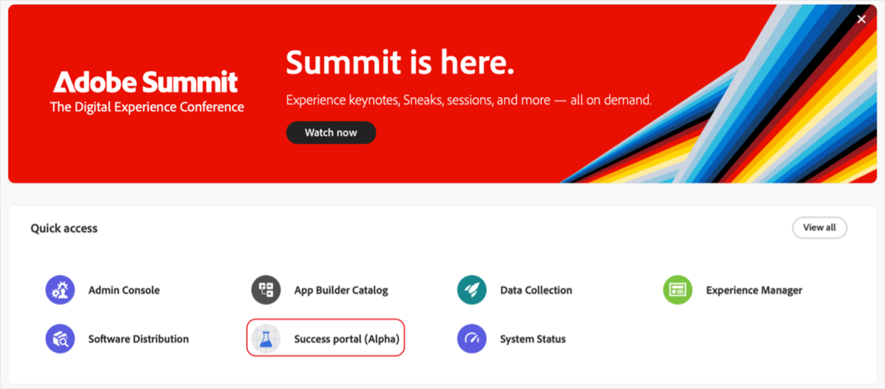
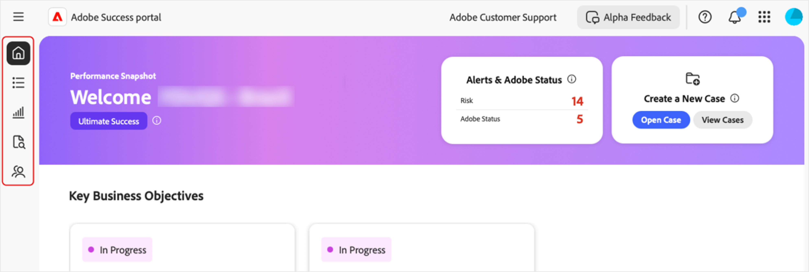

# Acessar o portal [!DNL Adobe Success]

Este guia explica como fazer logon no portal do [!DNL Adobe Success] e receber assistência em caso de problemas de acesso.

Você receberá uma notificação da equipe do portal de **[!UICONTROL Sucesso]** confirmando seu acesso. Esta mensagem incluirá detalhes de logon.

1. Ir para [https://experience.adobe.com/](https://experience.adobe.com/).
1. Faça logon com sua Adobe ID.
1. Selecione o ícone do **[!UICONTROL Portal de sucesso (Alpha)]**.

   

1. Depois de conectado, você verá cinco guias:

   

   * Início
   * **[!UICONTROL Plano de ação]**
   * **[!UICONTROL Rastreador de valores]**
   * **[!UICONTROL Suporte e Insights]**
   * **[!UICONTROL Plano de compromisso de suporte]**

## Solução de problemas e suporte

Se tiver problemas ao acessar o portal ou seus recursos, entre em contato com nossa equipe usando o [canal do Alpha Teams](https://teams.microsoft.com/l/channel/19:h-GcuAZs9uF05rervqTdx2U27ohYINuRUIfbMte9B-U1@thread.tacv2/General?groupId=02b87789-3475-47e4-94c1-0981f63ae89f&tenantId=fa7b1b5a-7b34-4387-94ae-d2c178decee1).   

Você pode usar o botão **[!UICONTROL Comentários sobre o Alpha]** no portal para enviar comentários.

>[!NOTE]
>
>A ferramenta de feedback não é um canal de suporte dedicado. Não é adequado para problemas urgentes de logon.

