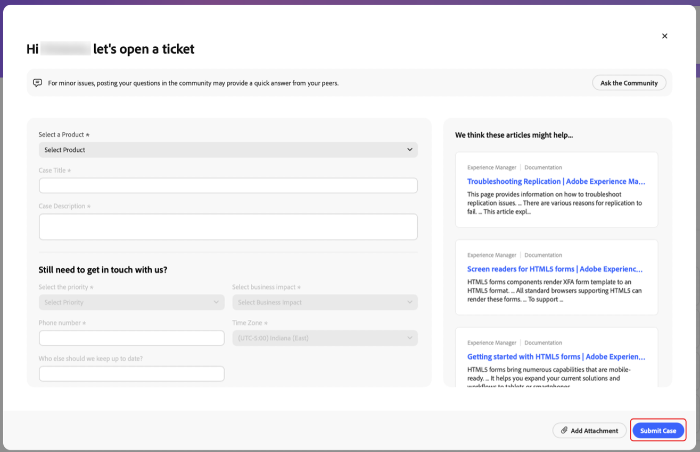
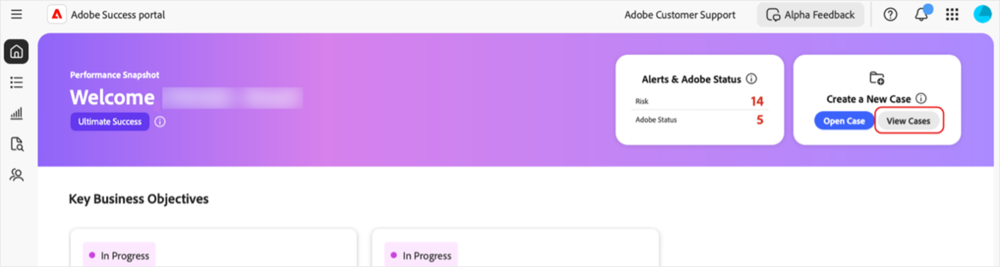
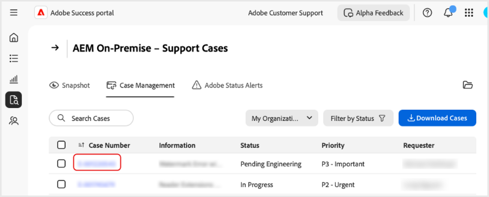

# Criar e gerenciar casos no portal [!DNL Adobe Success]

Este guia explica como criar, visualizar e baixar relatórios para casos no portal [!DNL Adobe Success].

## Abrir um caso

Você pode abrir um caso na guia Página inicial ou na guia **[!UICONTROL Suporte e insights]**.

Para acessar a página **[!UICONTROL Abrir caso]** na guia Página Inicial:

1. Vá para a guia Página inicial.
1. Selecione **[!UICONTROL Abrir caso]**.

   

1. Preencha os campos exigidos:
   1. **[!UICONTROL Selecione um produto]**.
   1. **[!UICONTROL Título do caso]**.
   1. **[!UICONTROL Descrição de caso]**.
1. Selecione **[!UICONTROL Enviar caso]**.

   

Para acessar a página **[!UICONTROL Abrir caso]** na guia **[!UICONTROL Suporte e insights]**.

1. Vá para a guia **[!UICONTROL Suporte e insights]**.
1. Selecione **[!UICONTROL Abrir caso]**.

   

Siga as mesmas etapas descritas acima para concluir e enviar o caso.

## Visualizar um caso

Você pode visualizar um caso na guia Página inicial ou na guia **[!UICONTROL Suporte e insights]**.

Para acessar a página **[!UICONTROL Visualizar casos]** na guia Página inicial:

1. Vá para a guia Página inicial.
1. Selecione **[!UICONTROL Visualizar casos]**.

   

1. Selecione o cartão de produto que deseja visualizar e escolha **[!UICONTROL Casos abertos]** ou **[!UICONTROL Casos fechados]**.

   >[!NOTE]
   >
   >Você também pode selecionar a guia **[!UICONTROL Suporte e insights]** para acessar rapidamente os cartões de produto com os links para **[!UICONTROL Casos abertos]** ou **[!UICONTROL Casos fechados]**.

   

1. Clique no **[!UICONTROL Número do caso]** para visualizar os detalhes.

   

## Baixar relatórios de caso

Para baixar relatórios em PDF dos casos:

1. Navegue até a guia Página inicial.
1. Selecione **[!UICONTROL Visualizar casos]**.

   

1. Selecione o cartão de produto que deseja visualizar e escolha **[!UICONTROL Casos abertos]** ou **[!UICONTROL Casos fechados]**.

   >[!NOTE]
   >
   >Você também pode selecionar a guia **[!UICONTROL Suporte e insights]** para acessar rapidamente os cartões de produto com os links para **[!UICONTROL Casos abertos]** ou **[!UICONTROL Casos fechados]**.

   

1. Na página [Produto] - Casos de suporte, marque a caixa de seleção ao lado do caso que deseja baixar e selecione **[!UICONTROL Baixar casos]**.

   
