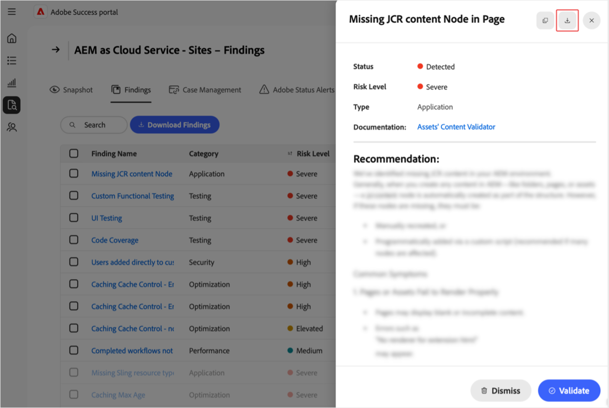

# Gerenciar descobertas no portal [!DNL Adobe Success]

Este guia explica como acessar, interpretar e agir de acordo com as descobertas no portal [!DNL Adobe Success] para ajudá-lo a gerenciar proativamente o desempenho do produto, a segurança e os riscos de funcionalidade.

A página [!DNL Adobe Success]Descobertas **[!UICONTROL do portal]** exibe problemas ou riscos detectados na instância do produto Adobe. Os resultados incluem problemas de desempenho, segurança e funcionalidade, juntamente com seu status e nível de risco. O monitoramento desta página ajuda a resolver problemas antecipadamente - antes que eles afetem seus ambientes.

**O que são descobertas?**

As descobertas são alertas de Insights de Suporte mostrados no portal [!DNL Adobe Success]. Eles destacam possíveis problemas na configuração do produto Adobe, como lentidão de desempenho, riscos de segurança ou configurações incorretas. Esses alertas são baseados em dados de telemetria coletados de ferramentas como APIs, [!DNL New Relic] e [!DNL Splunk].

**Como as descobertas são criadas?**

As equipes da Adobe estudam regularmente os problemas e as tendências mais comuns de suporte. Com base nos insights, eles adicionam novas verificações ao sistema. Uma vez por dia, o portal do [!DNL Adobe Success] verifica os dados do produto para detectar problemas, como configurações incorretas, tarefas paralisadas ou qualquer coisa que possa causar uma interrupção do sistema. Se uma verificação encontrar algo fora do intervalo seguro (conforme definido pelas equipes de produto e suporte da Adobe), ela será exibida como uma conclusão.

**Por que os resultados são importantes**

A análise regular dos resultados ajuda a detectar problemas antecipadamente — antes que eles afetem o sistema ou os clientes. Essa abordagem proativa melhora a estabilidade do sistema, reduz o tempo de inatividade e aceita as práticas recomendadas.

**Como corrigir descobertas**

Cada descoberta inclui recomendações e instruções claras sobre como resolver o problema, além de links para a documentação relevante, se disponível. Compartilhe essas descobertas com sua equipe de TI, de engenharia ou com um parceiro da Adobe e trabalhe em conjunto para resolvê-las. A correção desses problemas antecipadamente ajuda a evitar problemas maiores e mantém o sistema em execução sem problemas.

## Acessar descobertas

Para exibir insights de um produto:

1. Navegue até **[!UICONTROL Suporte e Insights]**.
1. Selecione o cartão do produto relevante. Selecione a guia **[!UICONTROL Descobertas]**.

   

1. Você verá uma lista de todas as descobertas do produto selecionado.

   

1. A partir daqui, você pode:

   

   * Procurar entradas específicas.
   * Exporte a lista de descobertas selecionando **[!UICONTROL Baixar Descobertas]**. Para exportar um relatório para uma descoberta, marque a caixa de seleção ao lado da descoberta relevante na coluna **[!UICONTROL Nome da Descoberta]**. Se você não selecionar uma descoberta, a PDF, por padrão, conterá uma lista de todas as descobertas.
   * Veja detalhes de uma descoberta, incluindo uma resolução recomendada selecionando uma descoberta em **[!UICONTROL Nome da Descoberta]**. A página Detalhes da descoberta exibe a descoberta selecionada com contexto adicional e uma recomendação. Para ver esse relatório, selecione a seta de download.

     

## Achados de ação

Siga estas etapas para validar se cada conclusão ainda é aplicável ou pode ser rejeitada.

>[!NOTE]
>
>As verificações padrão são executadas em suas instâncias. Se as verificações não detectarem que o problema está presente na instância, o status será **[!UICONTROL Não detectado]**.

1. Navegue até **[!UICONTROL Suporte e Insights]**.
1. Selecione o cartão do produto relevante.
1. Abra a guia **[!UICONTROL Achados]**. Você verá todos os resultados do produto selecionado.
1. Selecione uma entrada em **[!UICONTROL Nome da Descoberta]**. Na página Detalhes da descoberta, é possível:
   * Selecione **[!UICONTROL Validar]** para verificar se o problema ainda está presente (o botão **[!UICONTROL Validar]** foi criado como uma confirmação de que o problema foi resolvido):

   

   * Se o problema persistir, a seguinte mensagem será exibida: *[!UICONTROL Validação concluída. Encontrando ainda detectado]*. Use as informações e recomendações da página Detalhes da descoberta para investigar e resolver.
   * Se o problema não estiver mais presente, a seguinte mensagem será exibida: *[!UICONTROL Validação concluída. Não foi mais detectada uma descoberta]*. Quando o achado não é mais detectado, ele fica cinza e o status muda para **[!UICONTROL Não detectado]**. Achados com o status **[!UICONTROL Não Detectado]** estão localizados na parte inferior da lista de achados.
   * Se o problema não for aplicável ou relevante para você, você pode descartá-lo selecionando a opção **[!UICONTROL Ignorar]**. Quando a descoberta é descartada, a descoberta fica acinzentada e o status muda para **[!UICONTROL Descartada]**.  Achados com o status **[!UICONTROL Descartado]** estão localizados na parte inferior da lista de achados.

## Entender as descobertas

* **[!UICONTROL Nome da Descoberta]** - Selecione para obter informações detalhadas e etapas de resolução recomendadas.
* **[!UICONTROL Tipo]** - Categorizado como *Funcionalidade*, *Desempenho* e *Segurança*.
* **[!UICONTROL Nível de Risco]** - Indicador de severidade, com indicadores visuais.
* **[!UICONTROL Status]** - O estado atual da descoberta (por exemplo, *Detectado*, *Não Detectado*, *Descartado*).
* **[!UICONTROL Verificar Última Execução]** - Carimbo de data/hora da última verificação que atualizou a descoberta.

## Práticas recomendadas

A página **[!UICONTROL Descobertas]** lista recomendações com os seguintes níveis de risco: **[!UICONTROL Alta]**, **[!UICONTROL Elevada]** e **[!UICONTROL Medium]**. **[!UICONTROL Alta]** é crítica, **[!UICONTROL Elevada]** é urgente e **[!UICONTROL Medium]** não é crítica. Para manter a integridade e o desempenho do site:

* Aborde prontamente as descobertas de **[!UICONTROL Alto risco]**, pois representam ameaças críticas.
* Resolva os problemas de risco **[!UICONTROL Elevado]** em breve para evitar o escalonamento.
* Monitore regularmente as conclusões de risco do **[!UICONTROL Medium]** e aja conforme necessário.

