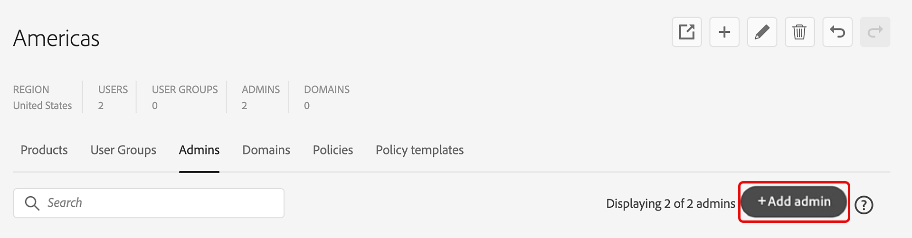

# Gerenciar administradores

*Aplica-se à empresa.*

Explore os recursos do administrador global e saiba como delegar e distribuir a administração de usuários, licenças de produtos e grupos para administradores de cada organização individual.

Na Global Admin Console, você pode selecionar uma organização e navegar até a guia **[!UICONTROL Administradores]** para adicionar, editar ou remover direitos de administrador. Para saber mais, consulte [Adotar administração global](https://helpx.adobe.com/br/enterprise/global-admin-console/adopt-global-administration.html). Acesse aqui para [entrar na Admin Console](https://adminconsole.adobe.com).

O Global Admin Console introduz uma função chamada de administrador global. Essa função é distinta de um administrador do sistema e permite que você faça o seguinte:

- Visualize o cenário global do seu investimento total no Adobe em todas as instâncias do Admin Console adicionadas à hierarquia do Global Admin Console.
- Monitore as atribuições de licença e recursos do Adobe e o uso em várias instâncias do Admin Console.
- Crie organizações ou consoles de administração.
- Alocar licenças de produto de um Admin Console raiz ou pai para Admin Console filho abaixo da hierarquia.
- Mantenha as operações diárias enquanto os administradores do sistema continuam gerenciando seus próprios Admin Consoles. Por exemplo, um Administrador global pode alocar um produto a um Admin Console secundário, mas não pode atribuí-lo a usuários. O administrador do sistema receberá as vagas no Admin Console e atribuirá os produtos aos usuários.
- Opcionalmente, aplique políticas organizacionais a qualquer Admin Console na hierarquia.

## Tarefas administrativas fundamentais

O Global Admin Console foi projetado para funcionar em várias organizações e no Admin Console. A tabela a seguir descreve os diferentes recursos e onde eles podem ser concluídos: Admin Console ou Global Admin Console.

<table>
  <tr>
    <th colspan="2">Tarefa</th>
    <th>Global Admin Console</th>
    <th>Admin Console</th>
  </tr>

<tr>
    <td colspan="2">Criar, adicionar pai e excluir organizações filhas</td>
    <td align="center">Sim</td>
    <td align="center">Não</td>
  </tr>

<tr>
    <td colspan="2">Trabalhar com várias organizações</td>
    <td align="center">Sim</td>
    <td align="center">Não</td>
  </tr>

<tr>
    <td rowspan="2" valign="middle">Gerenciar administradores</td>
    <td>Para uma ou mais organizações</td>
    <td align="center">Sim</td>
    <td align="center">Não</td>
  </tr>

<tr>
    <td>Para uma organização</td>
    <td align="center">Sim</td>
    <td align="center">Sim</td>
  </tr>

<tr>
    <td colspan="2">Gerenciar perfis de produtos e grupos de usuários</td>
    <td align="center">Sim</td>
    <td align="center">Sim</td>
  </tr>

<tr>
    <td colspan="2">Definir e gerenciar políticas</td>
    <td align="center">Sim</td>
    <td align="center">Não</td>
  </tr>

<tr>
    <td colspan="2">Alocar produtos entre organizações</td>
    <td align="center">Sim</td>
    <td align="center">Não</td>
  </tr>

<tr>
    <td colspan="2">Alocar produtos aos usuários</td>
    <td align="center">Não</td>
    <td align="center">Sim</td>
  </tr>

<tr>
    <td colspan="2">Gerenciar usuários</td>
    <td align="center">Não</td>
    <td align="center">Sim</td>
  </tr>

<tr>
    <td colspan="2">Gerenciar pacotes</td>
    <td align="center">Não</td>
    <td align="center">Sim</td>
  </tr>

<tr>
    <td colspan="2">Configurar domínios e diretórios</td>
    <td align="center">Não</td>
    <td align="center">Sim</td>
  </tr>

<tr>
    <td colspan="2">Gerenciar armazenamento e criptografia corporativos</td>
    <td align="center">Não</td>
    <td align="center">Sim</td>
  </tr>
</table>

## Gerenciar administradores

Você pode criar uma hierarquia administrativa flexível que permita o gerenciamento refinado do acesso e uso dos produtos da Adobe. Semelhante ao Adobe Admin Console, o Global Admin Console permite adicionar administradores de sistema, administradores de produtos, administradores de perfis de produtos, administradores de grupos de usuários, administradores de implantação, administradores de suporte e administradores de armazenamento. Esses administradores podem executar suas respectivas tarefas administrativas nas organizações das quais são administradores. Além dessas funções, há duas novas funções para a administração global: Administrador global e Visualizador global.

A Administração global é uma função transitiva. Tornar um usuário o Administrador global de uma organização torna automaticamente esse usuário um Administrador global de todos os filhos dessa organização, direta ou indiretamente. Além disso, se uma nova organização for criada na hierarquia da organização, todos os administradores globais de qualquer pai dessa organização se tornarão imediatamente administradores globais da organização recém-criada.

Estes são os recursos da função Administrador global:

- Criar e excluir organizações-filho
- Definir e editar políticas
- Definir e modificar funções administrativas
- Adicionar e remover produtos em organizações secundárias
- Definir ou alterar alocações de recursos para organizações-filho
- Gerenciar perfis de produto e grupos de usuários

Estes são os recursos da função Visualizador global:

- Exiba a lista de grupos de usuários, produtos, perfis de produtos, administradores, políticas definidas e recursos na organização e nas organizações secundárias.

## Administração distribuída

Ao gerenciar administradores, um Administrador global pode delegar e distribuir a administração de usuários, licenças de produtos e grupos para administradores de cada organização individual. O administrador adicionado a uma organização por um administrador global recebe a flexibilidade de gerenciar a organização sem ter visibilidade sobre a administração de outras organizações. Assim, o Administrador global pode delegar a administração de recursos e usuários mantendo os dados nesses recursos e usuários isolados.

Um Administrador global pode criar organizações, distribuir recursos como produtos e armazenamento para essas organizações, gerenciar a configuração de identidades e criar e aplicar modelos de políticas da organização. Um administrador do sistema adicionado a uma organização por um Administrador global pode atribuir produtos a usuários, integrar usuários, criar e gerenciar perfis de produtos e executar outras tarefas administrativas nessa organização.

## Adicionar um administrador

1. Na [Global Admin Console](https://global-admin-console.adobe.com/), selecione uma organização para editar e navegue até a guia **[!UICONTROL Administradores]**.

1. Selecione **[!UICONTROL Adicionar Administrador]**.

   

1. Na caixa de diálogo **[!UICONTROL Adicionar Administrador]**, digite os **[!UICONTROL Detalhes do Usuário]**: Email, Nome, Sobrenome, Tipo de Conta e Código do País.

   Se você estiver tentando adicionar um usuário existente como administrador, escolha o mesmo tipo de conta do usuário existente, caso contrário, a operação de adição falhará.

   >[!NOTE]
   >
   > As organizações podem ter restrições sobre quais tipos de conta podem ser adicionados. Elas podem ser baseadas em [políticas](https://helpx.adobe.com/br/enterprise/global-admin-console/update-policies.html) ou em outros parâmetros de configuração de uma organização. Organizações não permitem adicionar usuários da Adobe ID e usuários da BusinessID ao mesmo tempo. Em geral, não deve haver usuários de ambos os tipos em uma organização, mas dependendo da ordem em que as regras são definidas, pode haver alguns usuários de um Tipo de conta específico que pré-datam a aplicação de políticas ou regras.

1. Selecione uma ou mais funções de administrador na seção **[!UICONTROL Direitos de administrador]**.

   Para funções como administrador de produto, administrador de perfil de produto e administrador de grupo de usuários, selecione os produtos, perfis e grupos específicos, respectivamente.

   

1. Selecione **[!UICONTROL Salvar]**.

1. Depois de editar as organizações, selecione **[!UICONTROL Revisar alterações pendentes]** e **[!UICONTROL Enviar alterações]** para [executar](https://helpx.adobe.com/br/enterprise/global-admin-console/execute-jobs.html) as alterações.

Quando uma função de administrador é adicionada, o usuário recebe uma notificação por email informando sobre a alteração em sua função.

Depois de adicionado, o administrador recebe uma mensagem de email convidando-o a aceitar sua função e fornecendo um link para a Admin Console. Se forem adicionados como administradores globais e alguma outra função, eles receberão dois convites, um para a Global Admin Console e outro para a Admin Console.

## Editar um administrador

1. Selecione uma organização para editar e navegar até a guia **[!UICONTROL Administradores]**.

1. Selecione o ícone **[!UICONTROL Mais Opções]** () do administrador relevante e selecione **[!UICONTROL Editar Administrador]**.

   

1. Atualize os detalhes do administrador e selecione **[!UICONTROL Salvar]**.

1. Selecione **[!UICONTROL Revisar alterações pendentes]** depois de concluir a edição das organizações.

Um comando separado é exibido na lista de alterações pendentes para cada função de administrador adicionada ou removida. Depois de revisar, selecione **[!UICONTROL Enviar alterações]** para [executá-las](https://helpx.adobe.com/br/enterprise/global-admin-console/execute-jobs.html).

## Remover direitos de administrador

1. Selecione uma organização para editar e navegar até a guia **[!UICONTROL Administradores]**.

1. Selecione o ícone **[!UICONTROL Mais Opções]** () do administrador relevante e selecione **[!UICONTROL Remover Direitos de Administrador]**.

   

1. Selecione **[!UICONTROL OK]** no diálogo de confirmação.

1. Selecione **[!UICONTROL Revisar alterações pendentes]** depois de concluir a edição das organizações. Depois de revisar, selecione **[!UICONTROL Enviar alterações]** para [executá-las](https://helpx.adobe.com/br/enterprise/global-admin-console/execute-jobs.html).

Depois que você exclui um administrador, o usuário recebe uma notificação por email informando sobre a perda de acesso ao Admin Console dessa organização.
