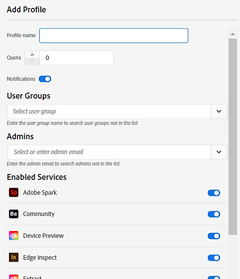

# Gerenciar perfis de produto no Global Admin Console

**Aplica-se a:** Empresa

Os administradores globais podem adicionar, editar e excluir perfis de produto no [Global Admin Console](https://global-admin-console.adobe.com/).

>[!NOTE]
>
>Na [Global Admin Console](https://experienceleague.adobe.com/pt-br/docs/support-resources/adobe-support-tools-guide/adobe-admin-console/adopt-global-administration#request-access-to-the-global-admin-console), selecione uma organização e navegue até **[!UICONTROL Produtos]**. É possível ativar todos os serviços ou os serviços selecionados de um produto usando Perfis de produto.

Como no Admin Console padrão, os perfis de produtos permitem ajustar o uso dos produtos em uma organização. Você também pode atribuir administradores — chamados de **[!UICONTROL Administradores de perfil de produto]** — a perfis de produto. Esses administradores podem adicionar usuários finais aos perfis de produtos que gerenciam.

Para gerenciar perfis de produtos, selecione um produto. Os controles para adicionar, editar e excluir perfis de produtos serão exibidos.

>[!NOTE]
>
>Para alguns produtos, não é possível criar ou editar Perfis de produto no Global Admin Console. Nesses casos, use a [Admin Console](https://experienceleague.adobe.com/pt-br/docs/support-resources/adobe-support-tools-guide/adobe-admin-console/admin-console-overview).

## Adicionar um perfil de produto

1. Na [Global Admin Console](https://global-admin-console.adobe.com/), selecione uma organização para editar e navegue até a guia **[!UICONTROL Produtos]**.
1. Selecione um produto ao qual adicionar um perfil de produto.
1. Selecione **[!UICONTROL Adicionar Perfil]**.
1. Na caixa de diálogo **[!UICONTROL Adicionar Perfil]**, insira os seguintes detalhes:

   | Campo | Descrição |
   |---|---|
   | **[!UICONTROL Nome]** | Um nome exclusivo para o perfil de produto na organização, diferente de outros Perfis de produto e grupos de usuários. |
   | **[!UICONTROL Cota]** | O número de destino de licenças alocadas para este perfil. |
   | **[!UICONTROL Grupos de usuários]** | Selecione na lista suspensa ou digite um nome de grupo de usuários. Se o grupo de usuários ainda não existir, crie-o primeiro por meio da guia [**[!UICONTROL Grupos de Usuários &#x200B;]**](https://helpx.adobe.com/br/enterprise/global-admin-console/manage-user-groups.html). |
   | **[!UICONTROL Administradores]** | Selecione na lista suspensa ou insira um endereço de email de administrador. Se o administrador ainda não existir, crie-o primeiro por meio da guia [**[!UICONTROL Administradores &#x200B;]**](https://experienceleague.adobe.com/pt-br/docs/support-resources/adobe-support-tools-guide/adobe-admin-console/manage-administrators). |

   O perfil de produto dos [!UICONTROL Grupos de Usuários] especificados foi atribuído. Os administradores especificados se tornam os **[!UICONTROL Administradores do Perfil de Produto]**, que podem gerenciar o perfil por meio da Adobe Admin Console para a organização relevante.

   

1. Use a opção **[!UICONTROL Notificações]** para habilitar ou desabilitar notificações por email. Quando ativados, os usuários são notificados por email quando são adicionados ou removidos do perfil.
1. Use os botões **[!UICONTROL Serviços]** individuais para habilitar ou desabilitar serviços específicos para o Perfil do Produto. Para obter mais informações, consulte [Habilitar/Desabilitar Serviços para um perfil de produto](https://helpx.adobe.com/br/enterprise/using/enable-disable-services.html).
1. Selecione **[!UICONTROL Salvar]**.
1. Selecione **[!UICONTROL Revisar alterações pendentes]** após concluir a edição das organizações. Depois de revisar, selecione **[!UICONTROL Enviar alterações]** para [executá-las](https://helpx.adobe.com/br/enterprise/global-admin-console/execute-jobs.html).

## Editar um perfil de produto

1. Selecione uma organização para editar, navegue até a guia **[!UICONTROL Produtos]** e selecione um produto.
1. Selecione o ícone **[!UICONTROL Mais Opções]**  para o perfil de produto relevante e selecione **[!UICONTROL Editar Perfil]**.
1. Atualize os detalhes do perfil de produto conforme necessário e selecione **[!UICONTROL Salvar]**.
1. Selecione **[!UICONTROL Revisar alterações pendentes]** após concluir a edição das organizações. Depois de revisar, selecione **[!UICONTROL Enviar alterações]** para [executá-las](https://helpx.adobe.com/br/enterprise/global-admin-console/execute-jobs.html).

## Excluir um perfil de produto

>[!WARNING]
>
> A exclusão de um perfil de produto remove o acesso ao produto para todos os usuários que eram membros desse perfil ou que pertenciam a grupos de usuários anexados a esse perfil.

1. Selecione uma organização para editar, navegue até a guia **[!UICONTROL Produtos]** e selecione um produto.
1. Selecione o ícone **[!UICONTROL Mais Opções]**  para o perfil de produto relevante e selecione **[!UICONTROL Excluir Perfil]**.
1. Selecione **[!UICONTROL OK]** na caixa de diálogo de confirmação.
1. Selecione **[!UICONTROL Revisar alterações pendentes]** após concluir a edição das organizações. Depois de revisar, selecione **[!UICONTROL Enviar alterações]** para [executá-las](https://helpx.adobe.com/br/enterprise/global-admin-console/execute-jobs.html).

## Leitura relacionada

- [Adotar administração global](https://experienceleague.adobe.com/pt-br/docs/support-resources/adobe-support-tools-guide/adobe-admin-console/adopt-global-administration)
- [Gerenciar administradores](https://experienceleague.adobe.com/pt-br/docs/support-resources/adobe-support-tools-guide/adobe-admin-console/manage-administrators)
- [Gerenciar grupos de usuários](https://experienceleague.adobe.com/pt-br/docs/support-resources/adobe-support-tools-guide/adobe-admin-console/manage-user-groups)
- [Alocar produtos a organizações derivadas](https://experienceleague.adobe.com/pt-br/docs/support-resources/adobe-support-tools-guide/adobe-admin-console/allocate-products)
- [Executar trabalhos pendentes](https://helpx.adobe.com/br/enterprise/global-admin-console/execute-jobs.html)
- [Habilitar/desabilitar serviços](https://helpx.adobe.com/br/enterprise/using/enable-disable-services.html)
- [visão geral do Admin Console](https://experienceleague.adobe.com/pt-br/docs/support-resources/adobe-support-tools-guide/adobe-admin-console/admin-console-overview)
