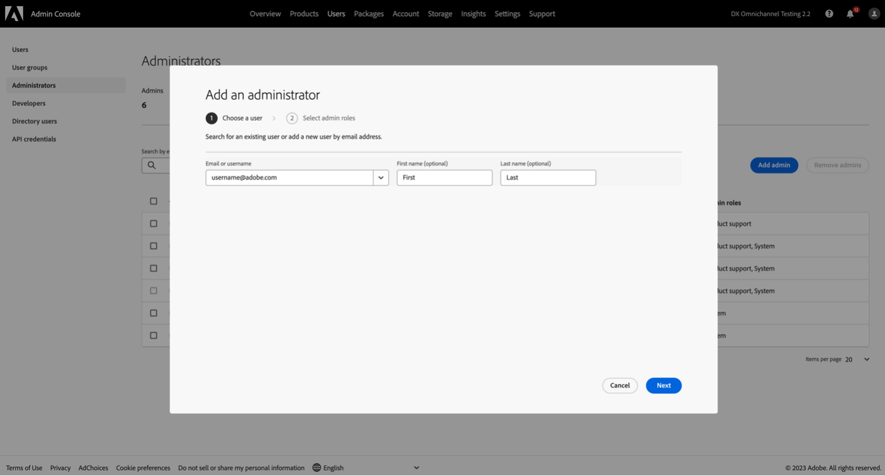
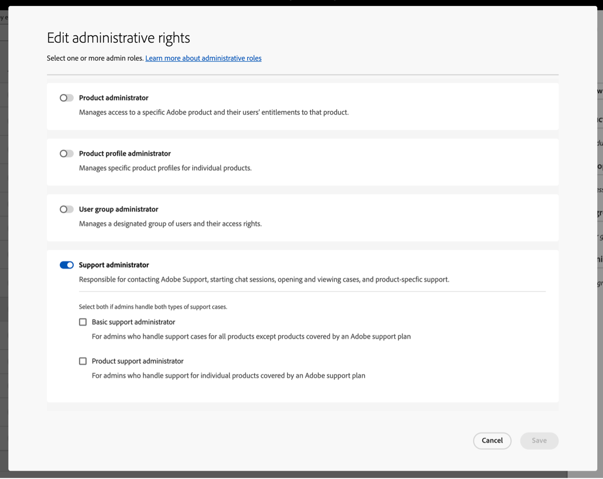
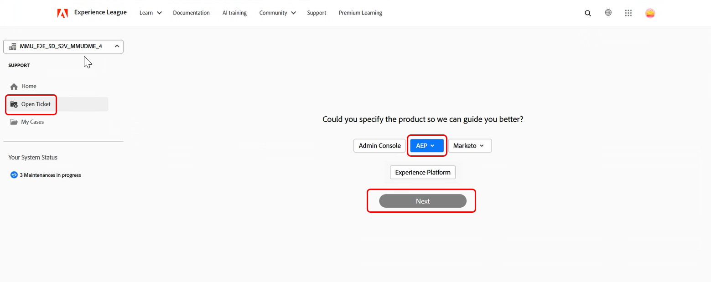
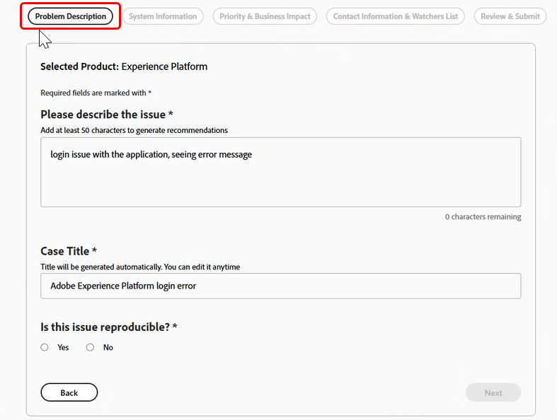
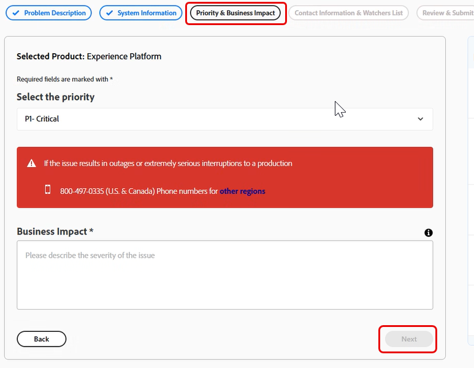
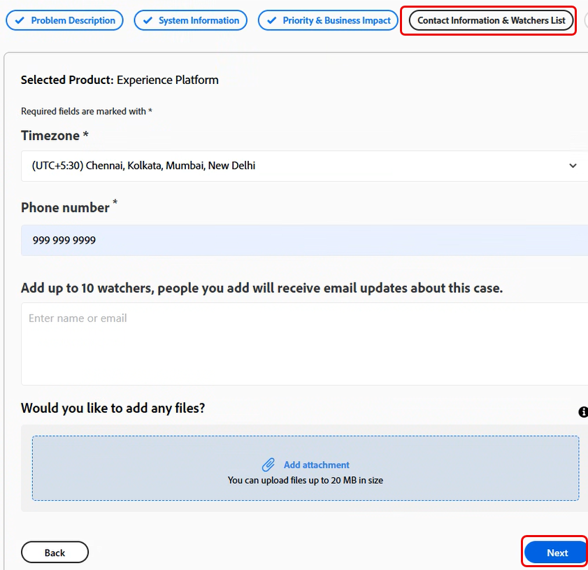

# Experiência de suporte ao cliente da Adobe

## Tíquetes de suporte da Experience League

Os tíquetes de suporte agora são enviados via [Experience League](https://experienceleague.adobe.com/home?lang=pt-BR#support). Para obter instruções sobre como enviar um tíquete de suporte, consulte a seção para [envio de um tíquete de suporte](#create-a-support-ticket-with-experience-league).

Estamos trabalhando para melhorar a forma como você interage com o Suporte ao cliente da Adobe. Nossa visão é simplificar a experiência de suporte migrando para um único ponto de entrada, usando o Experience League. Uma vez ao vivo, sua organização poderá acessar facilmente o Suporte ao cliente da Adobe, ter maior visibilidade de seu histórico de serviço por meio de um sistema comum entre os produtos e solicitar ajuda por telefone, Web e bate-papo em um único portal.

Se você for usuário do Adobe Commerce, consulte [Enviar um caso de suporte](https://experienceleague.adobe.com/pt-br/docs/commerce-knowledge-base/kb/help-center-guide/magento-help-center-user-guide#support-case) no Guia do Usuário de Suporte da Experience League para o Adobe Commerce.

## Funções de suporte qualificadas necessárias para o envio de caso {#submit-ticket}

Para enviar um tíquete de suporte no [Experience League](https://experienceleague.adobe.com/home?lang=pt-BR#support), você precisa ter a função de administrador de suporte atribuída por um Administrador do Sistema. Somente um Administrador do sistema em sua organização pode atribuir essa função. O Produto, o Perfil do Produto e outras funções administrativas não podem atribuir a função de administrador de Suporte e não podem exibir a opção **[!UICONTROL Criar Caso]** usada para enviar um tíquete de suporte. Para saber mais sobre os diferentes tipos de funções de administrador e seus direitos, consulte [Funções de administrador](admin-roles.md).

Se você estiver no Commerce, o processo para compartilhar o acesso para trabalhar com casos de suporte será diferente. Para saber mais, consulte [Acesso compartilhado: conceder privilégios para que outros usuários acessem sua conta](https://experienceleague.adobe.com/pt-br/docs/commerce-knowledge-base/kb/help-center-guide/magento-help-center-user-guide#shared-access) no Guia do Usuário do Suporte da Experience League para Adobe Commerce.

### Adicionar funções de direitos de suporte a uma organização

A função de administrador de suporte é uma função não administrativa que tem acesso a informações relacionadas a suporte. Os administradores de suporte podem exibir, criar e gerenciar relatórios de problemas.

Para adicionar ou convidar um administrador:

1. Na Admin Console, escolha **[!UICONTROL Usuários]** > **[!UICONTROL Administradores]**.
1. Clique em **[!UICONTROL Adicionar administrador]**.
1. Insira um nome ou endereço de email.

   Você pode pesquisar usuários existentes ou adicionar um novo usuário especificando um endereço de email válido e preenchendo as informações na tela.

   

1. Clique em **[!UICONTROL Avançar]**. Uma lista de funções administrativas é exibida.

Para atribuir uma função de administrador de suporte a um usuário (permitir que um usuário entre em contato com o suporte):

1. Selecione a opção **[!UICONTROL Administrador de suporte]**.

   

1. Escolha uma das duas opções a seguir:

   * Opção 1: **[!UICONTROL Administrador de suporte básico]**. Selecione essa opção se desejar conceder ao usuário suporte acesso a todas as soluções (exceto Marketo Engage).
   * Opção 2: **[!UICONTROL Administrador de suporte do produto]**: selecione esta opção para obter suporte do Marketo Engage. Selecione quais instâncias do Marketo Engage devem receber acesso de suporte do usuário.

   

1. Depois de fazer as seleções, clique em **[!UICONTROL Salvar]**.

O usuário recebe um convite por email sobre os novos privilégios administrativos de `message@adobe.com`.

Os usuários devem clicar em **Introdução** no email para ingressar na organização. Se os novos administradores não usarem o link **Introdução** no convite por email, eles não poderão entrar na Admin Console.

Como parte do processo de logon, os usuários podem ser solicitados a configurar um perfil do Adobe se ainda não tiverem um. Se os usuários tiverem vários perfis associados ao seu endereço de email, eles deverão escolher **Ingressar na Equipe** (se solicitado) e selecionar o perfil associado à nova organização.

Para obter mais detalhes, siga as instruções de [editar função de administrador corporativo](admin-roles.md#add-enterprise-role) na documentação de funções administrativas. Observe que somente um administrador do sistema de sua organização pode atribuir essa função. Para obter mais informações sobre hierarquia administrativa, consulte a documentação de [funções administrativas](admin-roles.md).

### Criar um tíquete de suporte com o Experience League

>[!NOTE]
>
> Antes de enviar um tíquete de suporte, verifique o desempenho, a disponibilidade e os problemas conhecidos do sistema Adobe no site [status do Adobe](https://status.adobe.com/pt-BR).

O Experience League é um portal de suporte de autoatendimento projetado para fornecer assistência personalizada e uma experiência fácil de usar para clientes autorizados.

1. Para criar um tíquete no [Experience League](https://experienceleague.adobe.com/home?lang=pt-BR#support), selecione a guia **[!UICONTROL Suporte]** na navegação superior.

   

1. No menu **[!UICONTROL Página Inicial]**, você pode **[!UICONTROL Abrir um tíquete de suporte]**, **[!UICONTROL Exibir e gerenciar casos]**, **[!UICONTROL Solicitar um Retorno de Chamada]** ou acessar recursos de aprendizado adicionais.

   A opção **[!UICONTROL Solicitar um Retorno de Chamada]** permite agendar reuniões na Web com compartilhamento de tela, permitindo uma resolução de problemas mais rápida e eficiente. Ele está disponível para o Adobe Experience Manager, Campaign e Workfront. As reuniões podem ser agendadas de acordo com a conveniência do cliente, e convites instantâneos são fornecidos. Para casos de Adobe Experience Manager P1, retornos de chamada imediatos são garantidos para permitir um engajamento rápido durante problemas críticos, ajudando a minimizar o tempo de inatividade e o impacto nos negócios.

   

1. Para enviar um caso, selecione **[!UICONTROL Abrir um tíquete de suporte]**. Você também pode selecionar o **[!UICONTROL Tíquete aberto]** no menu da barra lateral.

   

### Preencha o tíquete de suporte

Depois de selecionar **[!UICONTROL Abrir um tíquete de suporte]** ou **[!UICONTROL Abrir tíquete]**, o formulário de criação de caso é exibido.

O formulário usa um fluxo de trabalho guiado de várias etapas que ajuda a fornecer as informações necessárias para o Suporte da Adobe solucionar seu problema com eficiência. Você pode percorrer o formulário usando as seguintes seções:

* Seleção do produto
* Descrição do problema
* Prioridade e impacto nos negócios
* Informações de contato e lista de observadores
* Revisar e enviar

Você também pode **alternar entre seções** para atualizar informações antes de enviar o caso.

Siga estas etapas para criar um tíquete de suporte:

1. Clique no nome do produto para selecionar o produto afetado e clique em **[!UICONTROL Avançar]**.

   

1. Na seção **[!UICONTROL Descrição do Problema]**, digite uma descrição do problema. O título da ocorrência é gerado automaticamente com base na descrição do problema. Você pode editar o título, se necessário. Confirme se o problema pode ser reproduzido. Selecione **Sim** se o problema puder ser reproduzido. Será exibida uma caixa de texto onde você poderá descrever as etapas necessárias para reproduzir o problema. Selecione **Não** se o problema não puder ser reproduzido de forma consistente.

   

   Incluir detalhes como:

   * O que você está tentando fazer
   * O que não está funcionando como esperado
   * Etapas que você já realizou
   * Se o problema pode ser reproduzido

   À medida que você insere a descrição do problema, o Experience League exibe as recomendações habilitadas por IA em um painel ao lado do formulário. Estas recomendações:

   * Sugerir documentação relevante ou soluções conhecidas
   * Ajudar a confirmar se o problema já foi resolvido
   * Reduzir a necessidade de enviar um caso para problemas comuns

   O painel é exibido sem interromper o processo de criação de caso. Você pode revisar as recomendações a qualquer momento e continuar enviando o caso, se necessário.

   >[!NOTE]
   >
   >Para gerar recomendações, a **descrição do problema deve conter pelo menos 50 caracteres**. Um contador de caracteres em tempo real ajuda a rastrear o requisito mínimo.

   

1. Clique em **[!UICONTROL Avançar]**.

   

1. Na seção **[!UICONTROL Informações do Sistema]**, forneça a **[!UICONTROL Versão do Produto]**, **[!UICONTROL Ambiente]**, **[!UICONTROL Oferta de Produto]** e indique se alterações recentes foram feitas no ambiente ou na instância. Selecione **Sim** para fornecer detalhes adicionais sobre as alterações. Selecione **Não** se nenhuma alteração for feita e clique em **[!UICONTROL Avançar]**.

   >[!NOTE]
   >
   > Com base no produto selecionado, campos adicionais podem ser exibidos. Esses campos incluem detalhes sobre o ambiente em que o problema ocorre.

   

1. Na seção **[!UICONTROL Prioridade e impacto nos negócios]**, selecione o seguinte:
   * Prioridade de caso (P4 - Menor, P3 - Importante, P2 - Urgente, P1 - Crítico)
   * Forneça os detalhes do Impacto nos Negócios quando a Prioridade selecionada for P1 - Crítica e clique em **[!UICONTROL Avançar]**.

   

   Para obter detalhes sobre como a Prioridade de Casos e o Impacto nos Negócios afetam os tempos de resposta de suporte, consulte [Metas de tempo de resposta inicial de suporte](https://experienceleague.adobe.com/pt-br/docs/support-resources/data-sheets/overview#targeted-initial-response-times-for-support) na documentação sobre Planos de sucesso.

1. Na seção **[!UICONTROL Informações de Contato e Lista de Observadores]**, selecione o fuso horário, insira seu número de telefone, adicione observadores, anexe quaisquer arquivos, se necessário, e clique em **[!UICONTROL Avançar]**.

   

1. Na seção **[!UICONTROL Revisar e enviar]**, reveja os detalhes do seu caso e clique em **[!UICONTROL Aprovar e enviar caso]**.

   

   A etapa **[!UICONTROL Revisar e enviar]** resume todas as informações inseridas e permite:

   * Revisar todos os detalhes do caso em um local
   * Voltar para qualquer etapa anterior para fazer edições
   * Retornar ao resumo da revisão sem perder o progresso

Após o envio:

* O caso está conectado no Experience League
* Você pode rastrear atualizações e se comunicar com o Suporte por meio do portal
* O Suporte da Adobe responde com base na prioridade e no impacto fornecidos

>[!TIP]
>
> Se você não vir a opção **[!UICONTROL Abrir tíquete]** ou a guia **[!UICONTROL Suporte]**, entre em contato com o administrador do sistema para atribuir a função de administrador de Suporte.

>[!NOTE]
>
> Se o problema causar paralisações ou interrupções graves em um sistema de produção, um número de telefone será fornecido para assistência imediata.