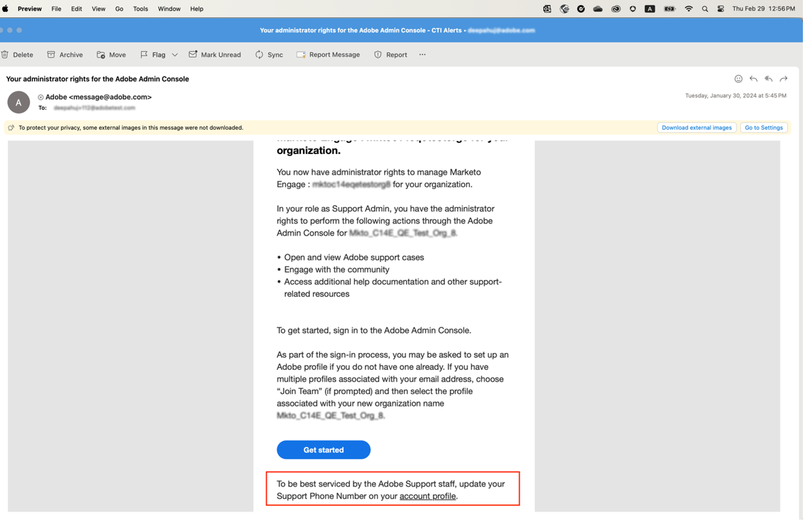

# Especifique um número de telefone de suporte preferencial

Quando uma função de **Administrador** é atribuída a você, como **Administrador de Suporte do Produto**, você recebe um email confirmando que tem permissões de administrador para gerenciar a instância.

O email agora contém o texto abaixo em vermelho que explica como acessar seu **[!UICONTROL Perfil de Conta]** e compartilhar conosco seu Número de Telefone de Suporte preferido.

Para especificar seu número de telefone preferido:

1. Clique no link **[!UICONTROL Perfil da Conta]** para abrir uma nova janela para entrar usando `account.adobe.com`.

   

1. Siga o processo de logon e acesse a tela abaixo em `account.adobe.com`.
1. Selecione **[!UICONTROL Conta e segurança]** > **[!UICONTROL Conta]** para ver o campo Número de telefone do suporte.
1. Adicione aqui um número de telefone que você gostaria que usássemos para reconhecê-lo de acordo com suas necessidades de suporte.

