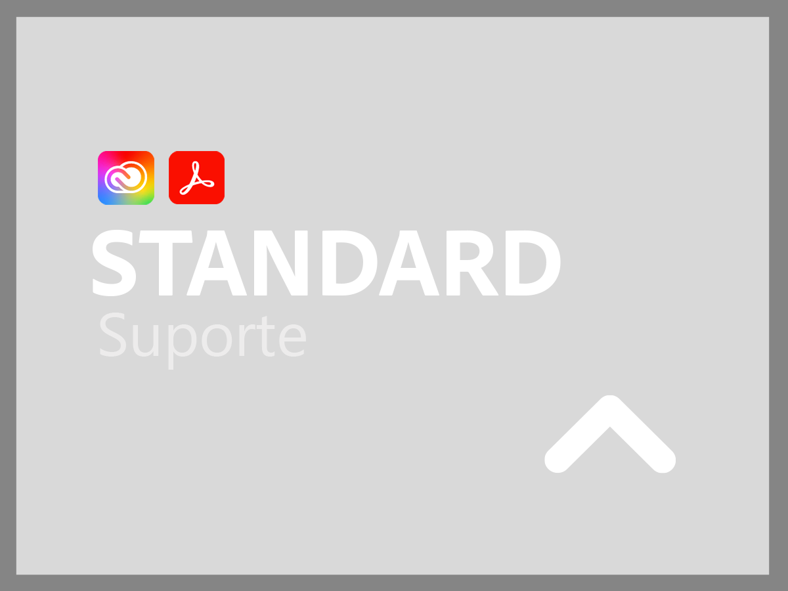
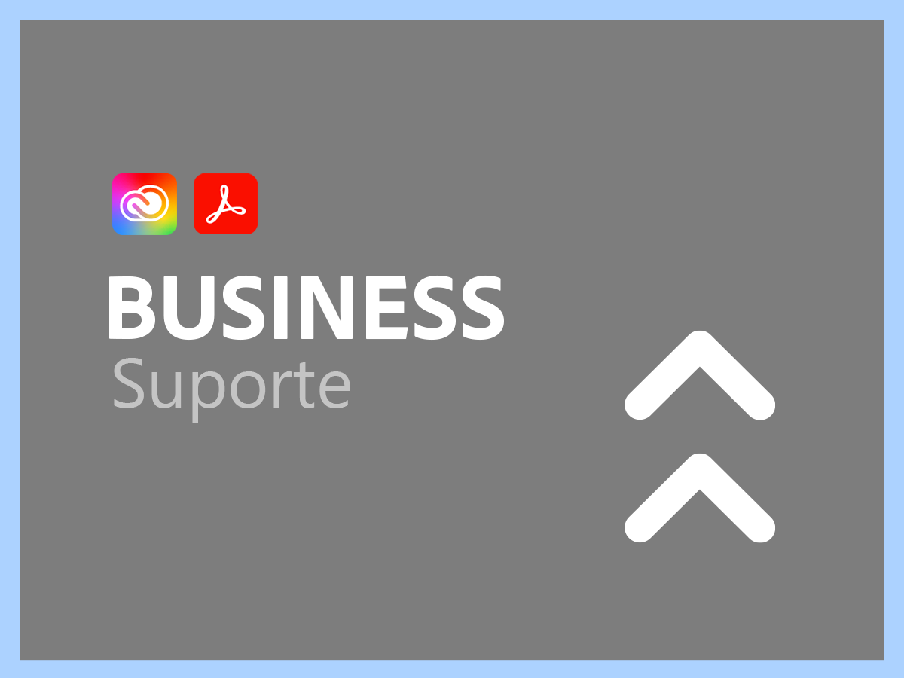
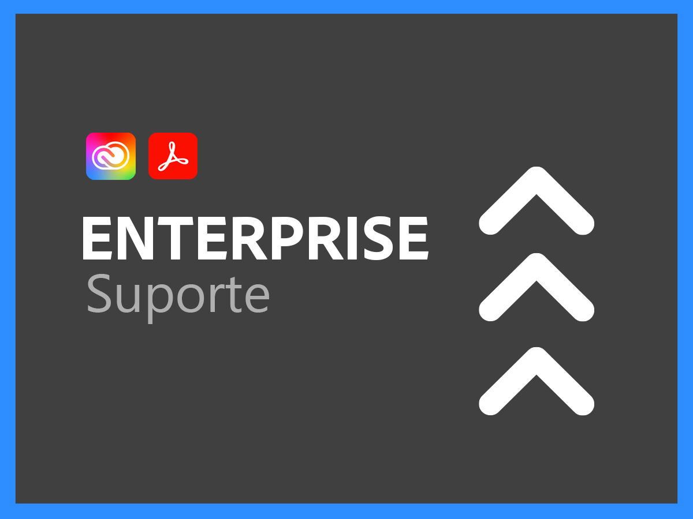
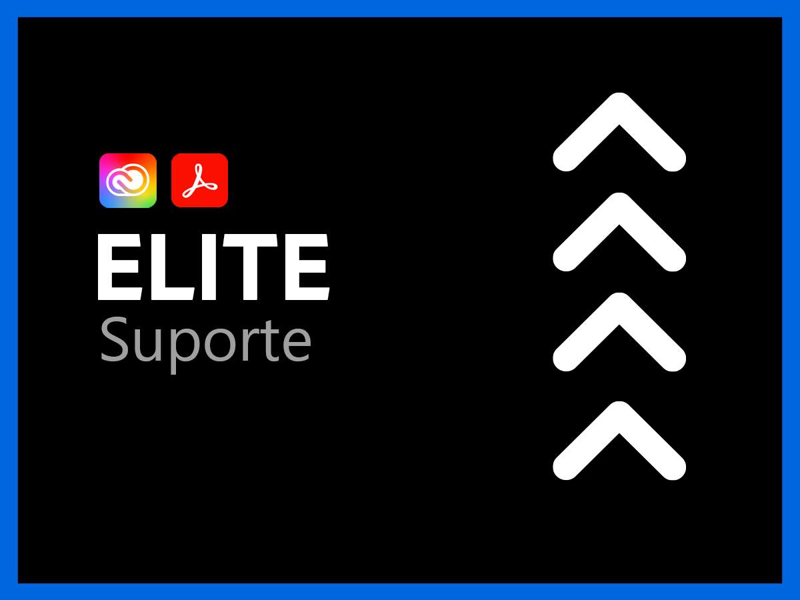

# Serviços de suporte para Creative Cloud Enterprise e Document Cloud

A organização de Suporte ao cliente Adobe Creative Cloud e Document Cloud está comprometida com seu sucesso. Todos os aplicativos incluem um nível de suporte que fornece acesso fácil a nossos recursos técnicos altamente qualificados para assistência técnica.

Para necessidades mais abrangentes, oferecemos Planos de Suporte Adobe que incluem acesso a profissionais de suporte nomeados e sessões para orientação pró-ativa e revisões de serviço. Independentemente da complexidade de suas necessidades de suporte, o Adobe oferece a experiência técnica e operacional necessária para ajudá-lo a alcançar o máximo desempenho e o melhor valor de seus aplicativos de Adobe.

<table style="table-layout:fixed">
<tr>
  <td>
    
    

    <a href="dme-standard.md"><strong>Suporte padrão</strong></a> (exibir <a href="assets/DMeStandardSupportDatasheet_2022.pdf" target="_blank">PDF</a>)
    

    
Acesso 24 horas por dia, 7 dias por semana, para usuários autorizados (administradores) às nossas equipes de suporte técnico por chat ou telefone, bem como a capacidade de registrar solicitações de assistência por meio de nosso portal de suporte da Web. 

     
  </td>
  <td>
    
    

    <a href="dme-business.md"><strong>Suporte Business</strong></a> (exibir <a href="assets/DMeBusinessSupportDatasheet_2022.pdf" target="_blank">PDF</a>)
    

    
Roteamento prioritário para casos de suporte para garantir uma conexão mais rápida com suporte mais sênior e a capacidade de aproveitar um lead para suporte de conta para receber comunicações e atualizações regulares para suas solicitações de suporte mais críticas.

     
  </td>
</tr>
<tr>
  <td>
    
    

    <a href="dme-enterprise.md"><strong>Suporte Enterprise</strong></a> (exibir <a href="assets/DMeEnterpriseSupportDatasheet_2022.pdf" target="_blank">PDF</a>)
    

    
Um contato técnico designado na equipe de suporte do Adobe com experiência profunda em sua solução funcionará em parceria com você e suas equipes técnicas para garantir a resolução oportuna de todas as solicitações de suporte.

     
  </td>
  <td>
    
    

    <a href="dme-elite.md"><strong>Suporte Elite</strong></a> (exibir <a href="assets/DMeEliteSupportDatasheet_2022.pdf" target="_blank">PDF</a>)
    

    
Foi designado um contato técnico na equipe de suporte do Adobe e um gerente de conta técnico que trabalha em parceria com você para fornecer o melhor suporte pró-ativo da classe para garantir que você maximize seu investimento e para ajudar a evitar problemas antes que eles aconteçam.

     
  </td>
</tr>
</table>

