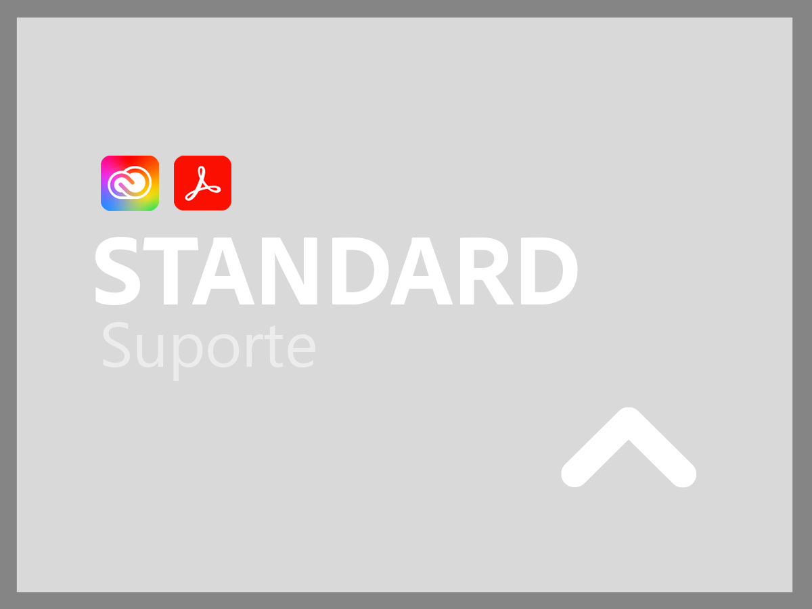
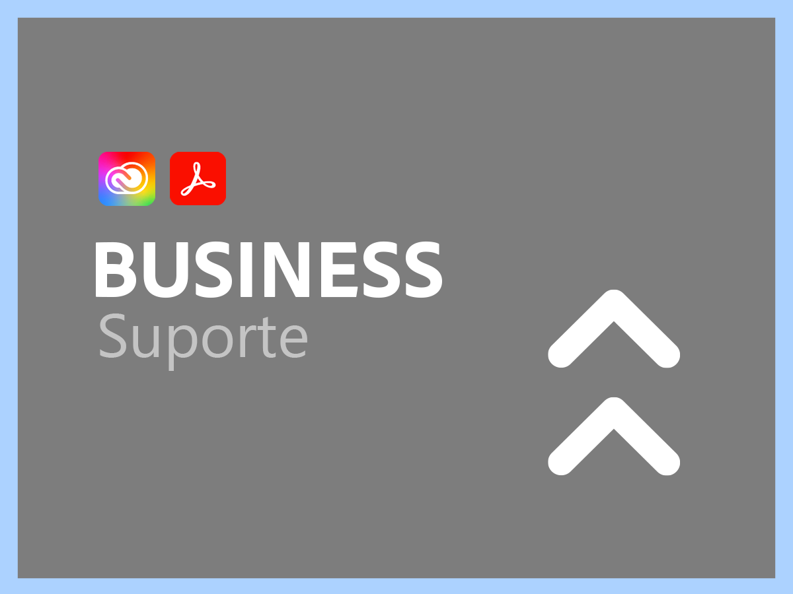
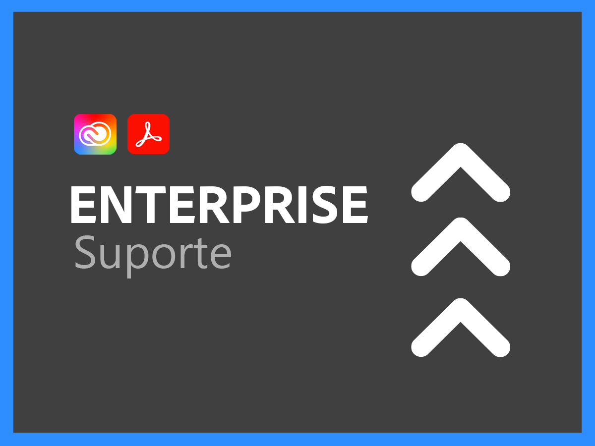

# Serviços de suporte da Creative Cloud para corporações e Document Cloud

A organização de Suporte ao cliente da Adobe Creative Cloud e da Document Cloud está comprometida com o seu sucesso. Todos os aplicativos incluem um nível de suporte que fornece acesso fácil a nossos recursos altamente qualificados para assistência técnica.

Para necessidades mais abrangentes, oferecemos os planos de suporte da Adobe, que incluem acesso a profissionais de suporte dedicados, além de sessões de orientação proativa e revisões de serviços. Independentemente da complexidade de suas necessidades de suporte, a Adobe oferece a experiência técnica e operacional necessária para ajudá-lo a alcançar desempenho máximo e valor otimizado nos seus aplicativos da Adobe.

<table style="table-layout:fixed">
<tr>
  <td>
    
    

    <a href="dme-standard.md"><strong>Suporte Standard</strong></a> (exibir <a href="assets/DMeStandardSupportDatasheet_2022.pdf" target="_blank">PDF</a>)
    

    
Usuários autorizados (administradores) têm acesso 24 horas por dia, 7 dias por semana às nossas equipes de suporte técnico por chat ou telefone, além da capacidade de registrar solicitações de assistência por meio de nosso portal de suporte na Web. 

     
  </td>
  <td>
    
    

    <a href="dme-business.md"><strong>Suporte Business</strong></a> (exibir <a href="assets/DMeBusinessSupportDatasheet_2022.pdf" target="_blank">PDF</a>)
    

    
Roteamento prioritário para casos de suporte, visando garantir uma conexão mais rápida com suporte de nível superior, além do auxílio de um líder de suporte de conta que fornecerá comunicados e atualizações regulares para suas solicitações de suporte mais importantes.

     
  </td>
</tr>
<tr>
  <td>
    
    

    <a href="dme-enterprise.md"><strong>Suporte Enterprise</strong></a> (exibir <a href="assets/DMeEnterpriseSupportDatasheet_2022.pdf" target="_blank">PDF</a>)
    

    
Um contato técnico designado da equipe de suporte da Adobe, com vasta experiência na solução, atuará em parceria com você e suas equipes técnicas para garantir a resolução de todas as solicitações de suporte dentro do prazo.

     
  </td>
  <td>
    
    

    <a href="dme-elite.md"><strong>Suporte Elite</strong></a> (exibir <a href="assets/DMeEliteSupportDatasheet_2022.pdf" target="_blank">PDF</a>)
    

    
Um contato técnico designado da equipe de suporte da Adobe e um gerente técnico de contas trabalharão em parceria com você para fornecer o melhor suporte proativo da categoria, garantindo a maximização de seu investimento e ajudando a evitar a ocorrência de problemas.

     
  </td>
</tr>
</table>

