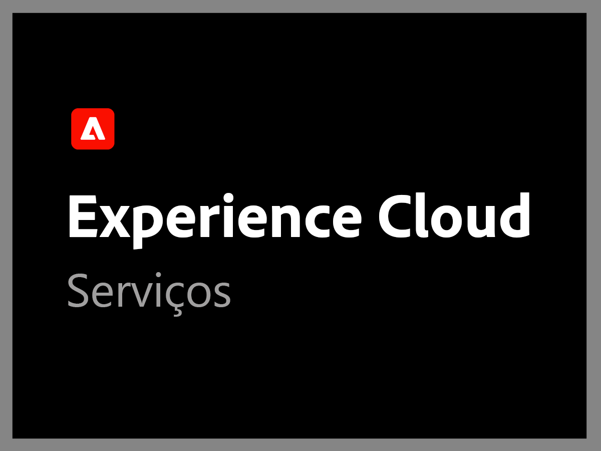
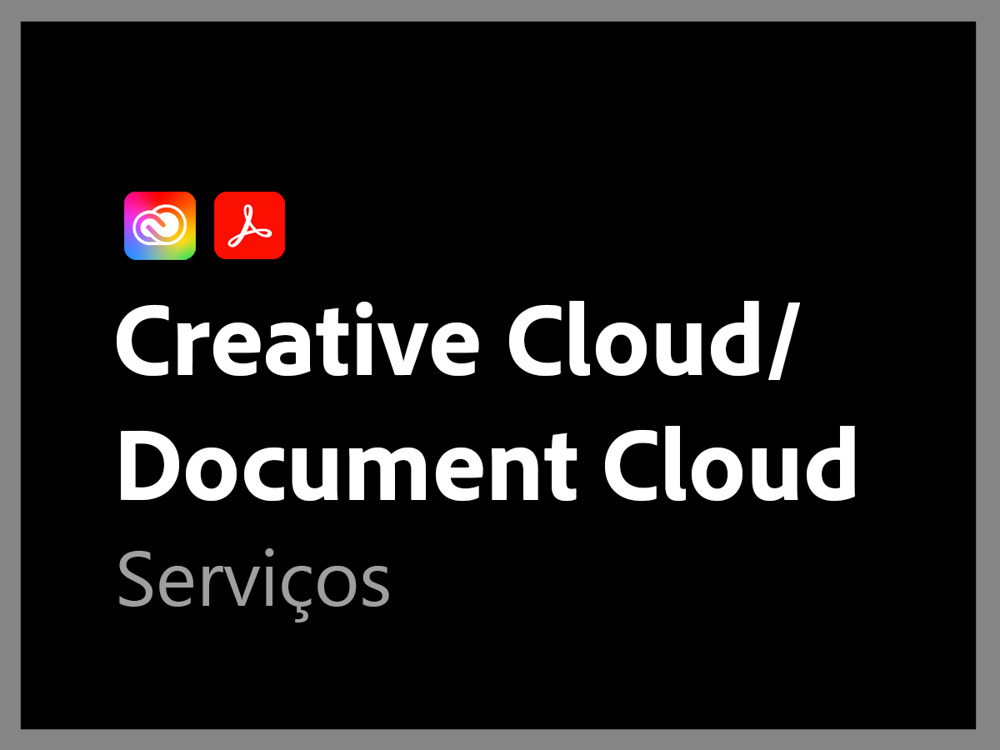

# Visão geral dos planos anteriores de suporte da Adobe

>[!NOTE]
>
>Esses planos se referem aos planos de suporte da Adobe anteriores a 16 de junho de 2022. Para consultar os planos de suporte atuais, acesse a [Visão geral da oferta de suporte da Adobe](overview.md).

A organização de suporte da Adobe está comprometida com o seu sucesso. Todas as assinaturas incluem um nível de suporte que fornece acesso fácil a nossos recursos técnicos de assistência técnica altamente qualificados.

Para necessidades mais abrangentes, oferecemos os serviços de suporte da Adobe, que incluem acesso a profissionais de suporte dedicados, além de sessões de orientação proativa e revisões de serviços. Independentemente da complexidade de suas necessidades de suporte, a Adobe oferece a experiência técnica e operacional necessária para ajudá-lo a alcançar desempenho máximo e valor otimizado na sua solução da Adobe.

<table style="table-layout:fixed">
<tr>
  <td>
    
    

    <a href="dx-overview.md"><strong>Suporte à Experience Cloud</strong></a>
    

    
Opções de suporte para produtos da Experience Cloud e Experience Platform

     
  </td>
  <td>
    
    

    <a href="dme-overview.md"><strong>Documentos de suporte da Creative Cloud Enterprise</strong></a>
    

    
Opções de suporte para produtos da Creative Cloud e Document Cloud

     
  </td>
</tr>
</table>
