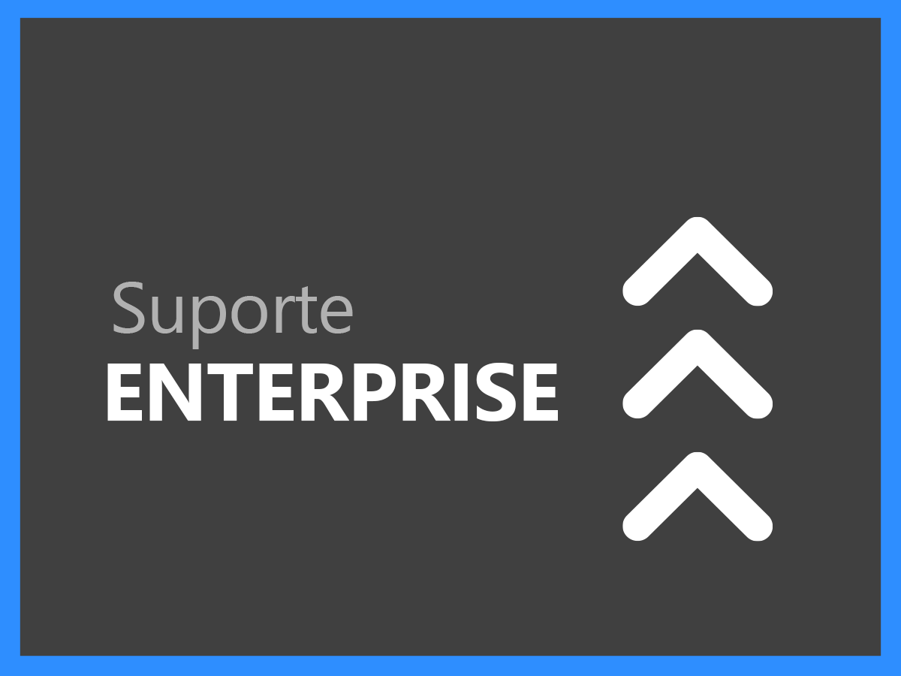
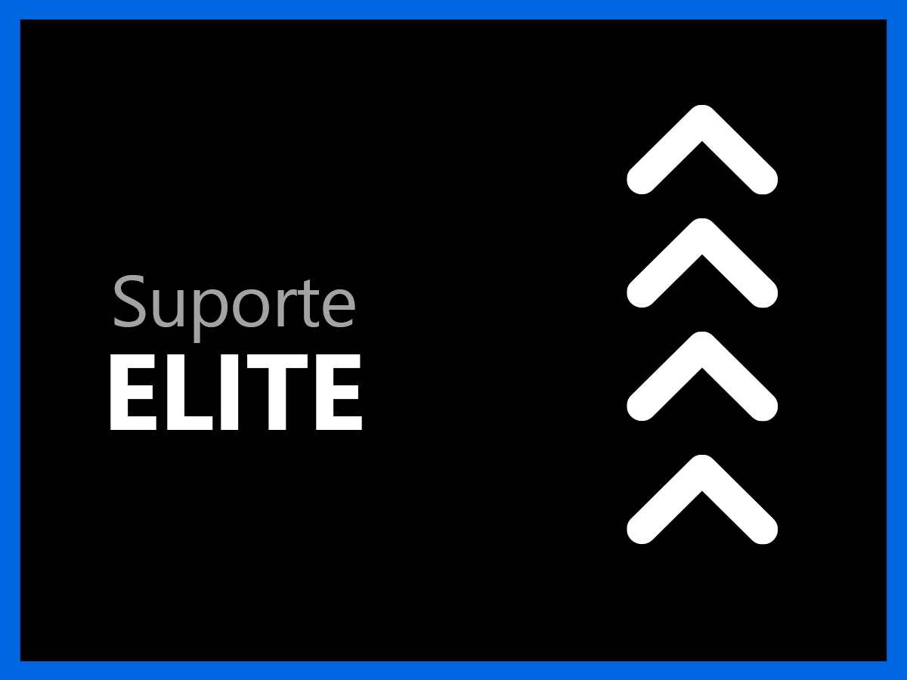

# Visão geral dos serviços de suporte

A organização de Suporte ao cliente da Adobe Experience Cloud está comprometida com seu sucesso. Todas as assinaturas incluem um nível de suporte que fornece acesso fácil a nossos recursos técnicos de assistência técnica altamente qualificados.

Para necessidades mais abrangentes, oferecemos serviços de suporte Adobe que incluem acesso a profissionais de suporte nomeados, metas aceleradas de resposta de nível de serviço e sessões para orientação proativa e revisões de serviço. Independentemente da complexidade de suas necessidades de suporte, a Adobe oferece a experiência técnica e operacional necessária para ajudar você a maximizar o desempenho e a obter valor otimizado da sua solução da Adobe.

<table style="table-layout:fixed">
<tr>
  <td>
    
    

    <a href="online.md"><strong>Suporte Online</strong></a> (exibir <a href="assets/OnlineSupportDatasheet.pdf" target="_blank">PDF</a>)
    

    
Acesso limitado ao suporte telefônico

     
  </td>
  <td>
    
    

    <a href="business.md"><strong>Suporte Business</strong></a> (exibir <a href="assets/BusinessSupportDatasheet.pdf" target="_blank">PDF</a>)
    

    
Acesso completo às equipes de suporte técnico da Adobe e a um Líder de suporte da conta para gerenciamento de conta

     
  </td>
</tr>
<tr>
  <td>
    
    

    <a href="enterprise.md"><strong>Suporte Enterprise</strong></a> (exibir <a href="assets/EnterpriseSupportDatasheet.pdf" target="_blank">PDF</a>)
    

    
Metas de suporte de nível de serviço (SLT) aprimorados, especialistas técnicos e um engenheiro de suporte nomeado que atua como defensor

     
  </td>
  <td>
    
    

    <a href="elite.md"><strong>Suporte Elite</strong></a> (exibir <a href="assets/EliteSupportDatasheet.pdf" target="_blank">PDF</a>)
    

    
As melhores metas de nível de serviço (SLT), suporte proativo e parceria com um Gerente técnico de conta e um engenheiro de suporte nomeado

     
  </td>
</tr>
</table>
